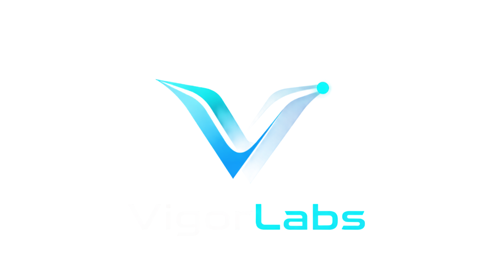

# VigorConnect SaaS Customer Documentation

Welcome to the official documentation hub for **VigorConnect** SaaS customers and developers. VigorConnect provides a high-performance, WebRTC-powered P2P connectivity layer for streaming live IP camera feeds into browser and mobile applications with ultra-low latency.

---

## 🌐 Live Repositories & Resources

- 📦 **Web SDK Reference**: [https://github.com/Vigor-RDLabs/VigorSDK](https://github.com/Vigor-RDLabs/VigorSDK)
- ⚙️ **Edge Gateway Releases**: [https://github.com/Vigor-RDLabs/vigor-gateway-releases](https://github.com/Vigor-RDLabs/vigor-gateway-releases)
- 📚 **Documentation Hub**: [https://github.com/Vigor-RDLabs/VigorDocuments](https://github.com/Vigor-RDLabs/VigorDocuments)

---

## 📸 Platform Interface Overview

### 1. Workspace Overview & Live IP Camera Grid

*Monitor onboarding progress, active stream sessions, TURN bandwidth consumption, and live multi-camera grids.*

### 2. Camera Management & Status List

*Manage camera pairings, licenses, site allocations, and streaming status.*

### 3. Site Operations & Facility Locations

*Geographic location mapping and gateway pairing across facility sites.*

### 4. Portal Sign-In & Authentication

*Secure single sign-on access to the VigorLabs camera operations platform.*

---

## 📚 Documentation Index

- **[Developer Quickstart Guide](./tutorials/DEVELOPER_QUICKSTART.md)**: Integrate `@vigor/camera-sdk` into your web application in under 10 minutes.
- **[5-Minute Web Player Demo](./tutorials/5_MINUTE_DEMO_GUIDE.md)**: Quick tutorial to run a sample HTML/JS player connected to VigorConnect SaaS.
- **[WebRTC P2P Client Architecture Specification](./architecture/CLIENT_ARCHITECTURE.md)**: Technical breakdown of signaling flow, WebRTC P2P ICE handshakes, and TURN relay fallbacks.
- **[Dashboard UI & Workflow Specification](./specifications/DASHBOARD_UI_UX_FLOW.md)**: Detailed guide on workspace onboarding, camera activation, and site mapping.

---

## License

MIT License. Copyright (c) 2026 VigorLabs.
