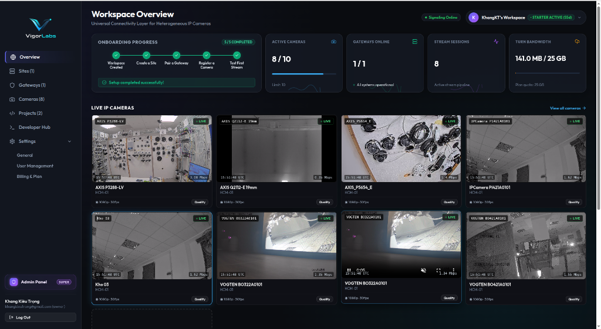
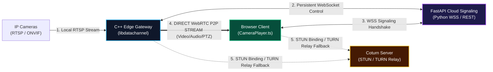
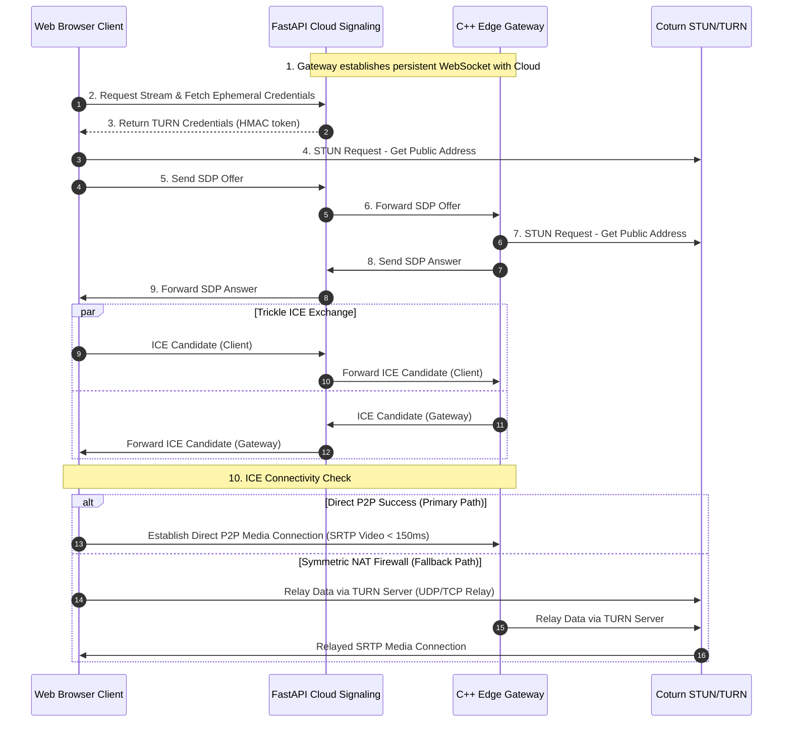

# WebRTC P2P Client Architecture Specification

This document details the client-side architecture, WebRTC P2P connection sequence flow, and media stream handshake protocols used by **VigorConnect**.



---

## 1. System Topology Overview



---

## 2. Architecture Block Diagram

```text
+-----------------------------------------------------------------------------------------+
|                                    EDGE / LAN NETWORK                                   |
|                                                                                         |
|  +------------------------+                        +---------------------------------+  |
|  |       IP Cameras       |                        |        C++ Edge Gateway         |  |
|  |  (RTSP H.264/265 Video | --- RTSP Streams ----> |   - RtspIngest / RtspP2PService |  |
|  |   & ONVIF SOAP/PTZ)    | <--- ONVIF PTZ ------- |   - libdatachannel Engine       |  |
|  +------------------------+                        +---------------------------------+  |
+--------------------------------------------------------------------|--------------------+
                                                                     |
                         = = = = = = = = = = = = = = = = = = = = = = | = = = = = = = = = =
                        ||   PRIMARY PATH: Direct WebRTC P2P Stream  |                   ||
                        ||   (Sub-second Latency ~150ms | Zero Cloud Media Overhead) ||
                         = = = = = = = = = = = = = = = = = = = = = = | = = = = = = = = = =
                                                                     |
                                                                     v
+------------------------------------+              +-------------------------------------+
|       CLOUD CONTROL PLANE          |              |            CLIENT PLANE             |
|                                    |              |                                     |
|  +------------------------------+  |  Signaling   |  +-------------------------------+  |
|  | FastAPI Signaling Server     | <== WSS/REST ==> |  |  Web Browser / React Admin    |  |
|  | (WebSocket Broker & Auth)    |  |              |  |  (CameraPlayer.ts SDK)        |  |
|  +------------------------------+  |              |  +-------------------------------+  |
|                 |                  |              +-------------------------------------+
|                 v                  |                                 ^
|  +------------------------------+  |                                 |
|  | Coturn STUN / TURN Server    |  | <.... STUN / TURN Relay .......+
|  | (NAT Traversal & Relay)      | ...................................+
|  +------------------------------+  |       (Fallback Secondary Path)
+------------------------------------+
```

---

## 3. WebRTC P2P Connection Sequence Flow



---

## 4. Key Protocol Specifications

| Feature / Protocol | Specification | Details |
| :--- | :--- | :--- |
| **Signaling Protocol** | WebSocket Secure (`wss://`) | JSON-RPC 2.0 SDP Offer / Answer exchange |
| **Video Codec** | H.264 / H.265 Passthrough | Zero-transcoding demuxing for ultra-low CPU overhead |
| **P2P Latency** | 100ms - 250ms | Direct SRTP peer-to-peer media transmission |
| **NAT Traversal** | STUN (UDP 3478) / TURN Relay | Full support for Symmetric NAT fallback |
| **Browser Compatibility** | Chrome, Edge, Firefox, Safari | 100% Native HTML5 WebRTC API (No plugins required) |

---

## Live Resources

- 📦 **Web SDK Reference**: [https://github.com/Vigor-RDLabs/VigorSDK](https://github.com/Vigor-RDLabs/VigorSDK)
- ⚙️ **Edge Gateway Releases**: [https://github.com/Vigor-RDLabs/vigor-gateway-releases](https://github.com/Vigor-RDLabs/vigor-gateway-releases)
- 📚 **Documentation Hub**: [https://github.com/Vigor-RDLabs/VigorDocuments](https://github.com/Vigor-RDLabs/VigorDocuments)
