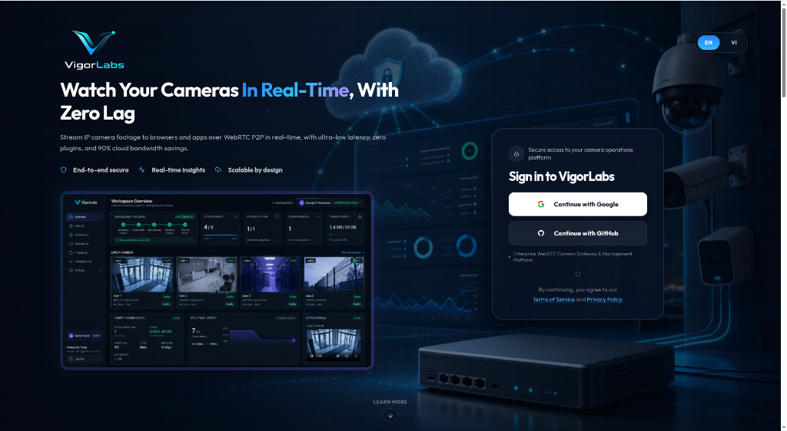
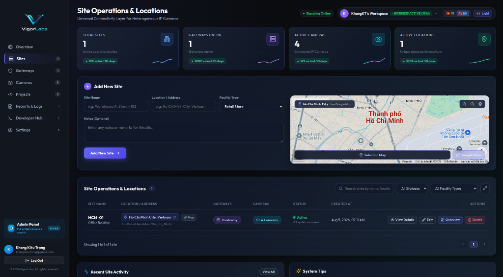
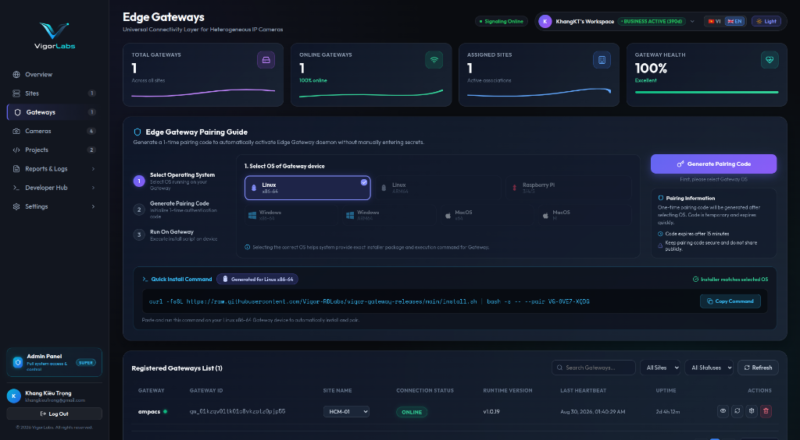
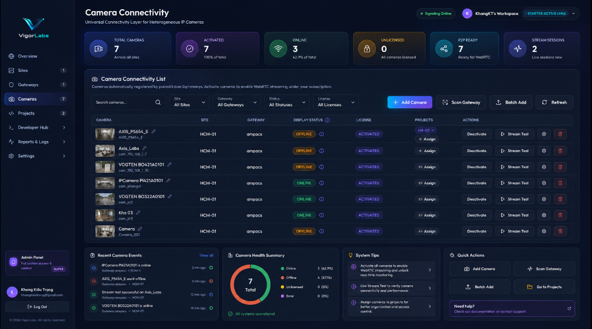

# 5-Minute Setup & Live Stream Demo Guide

This guide walks you through setting up your VigorConnect workspace, pairing an Edge Gateway, registering IP cameras, and verifying your first live WebRTC P2P video stream.

---

## Step 1: Sign in to VigorLabs Platform

Sign in to your VigorLabs Operations Platform account via single sign-on (Google or GitHub).



---

## Step 2: Create Facility Site

Navigate to **Sites** in the left sidebar and click **Add New Site** to define your physical location (e.g. Headquarters, Factory A, Store #102).



---

## Step 3: Pair Edge Gateway

Navigate to **Gateways** and generate a 1-time pairing code. Select your Gateway operating system (Linux x86_64, ARM64, Raspberry Pi, etc.) and run the installation script on your device:

```bash
curl -fsSL https://raw.githubusercontent.com/Vigor-RDLabs/vigor-gateway-releases/main/install.sh | bash -s -- --pair VG-8VE7-XQDG
```



*Binary downloads and version releases are available at [vigor-gateway-releases](https://github.com/Vigor-RDLabs/vigor-gateway-releases).*

---

## Step 4: Scan & Register IP Cameras

Navigate to **Cameras** to discover ONVIF/RTSP cameras on your gateway's local network. Click **Add Camera** to bind local RTSP streams to your VigorConnect subscription.



---

## Step 5: Test WebRTC P2P Video Stream

Navigate to **Overview** or click **Stream Test** on any online camera to verify sub-200ms real-time video playback directly in your browser.


---

## Next Steps

Once your cameras are online and stream testing is verified, proceed to the **[Developer Quickstart Guide](./DEVELOPER_QUICKSTART.md)** to generate API credentials and integrate video feeds into your custom web application.
