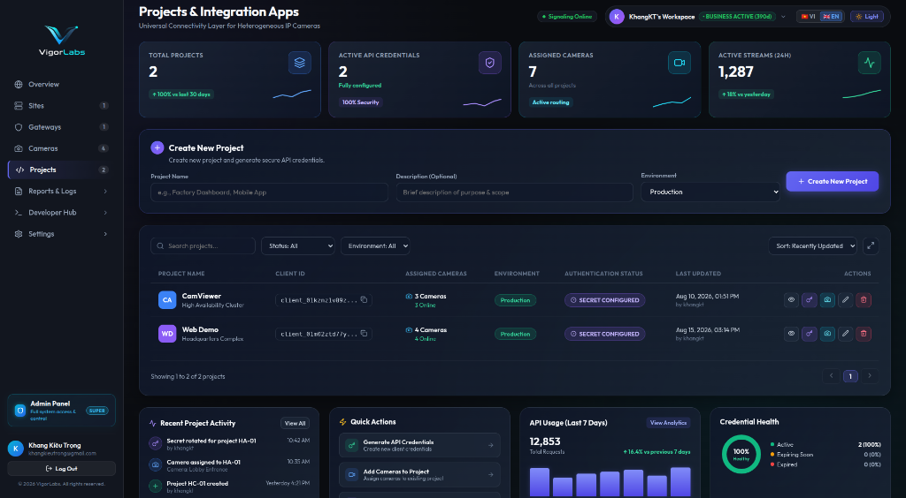
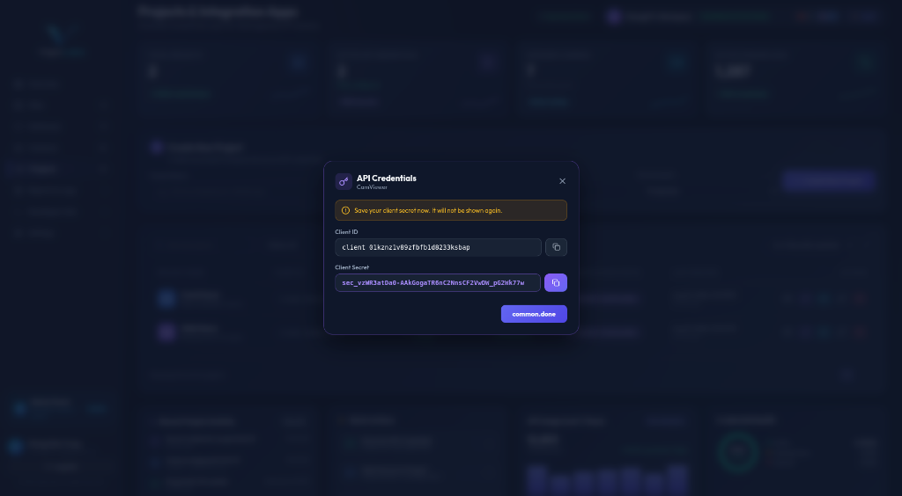

# Developer Quickstart Guide: Integrating Vigor Web SDK

This guide demonstrates how to generate API credentials, download the sample Web SDK client, and integrate live IP camera feeds into your custom web application.

---

## Prerequisite

Ensure your Edge Gateway is paired, your cameras are registered as **ONLINE**, and stream playback is verified ([5-Minute Setup Guide](./5_MINUTE_DEMO_GUIDE.md)).

---

## Step 1: Create a Project & Integration App

Navigate to **Projects** in the left sidebar and click **Create New Project** (e.g., `Factory Dashboard App`, `Mobile Monitoring App`).



---

## Step 2: Retrieve API Client ID & Client Secret

Upon creating your project, copy and securely store your API Credentials (`Client ID` & `Client Secret`).



> [!CAUTION]
> Your `Client Secret` is shown **only once**. Keep it secure on your backend server and never expose it in public client code.

---

## Step 3: Clone Web SDK Reference Example

Clone the official Web SDK reference repository from GitHub:

```bash
git clone https://github.com/Vigor-RDLabs/VigorSDK.git
cd VigorSDK
```

---

## Step 4: Configure Backend Token Endpoint & Test Stream

### 1. Backend: Obtain Short-Lived Viewer Token

Your customer backend uses your `Client ID` and `Client Secret` to request short-lived (15-min) Viewer Access Tokens:

```javascript
// Example Node.js Express Endpoint
app.get("/api/vigor-token", async (req, res) => {
  const response = await fetch("https://api.vigorlabs.ai/v1/auth/viewer-token", {
    method: "POST",
    headers: {
      "X-Client-ID": process.env.VIGOR_CLIENT_ID,
      "X-Client-Secret": process.env.VIGOR_CLIENT_SECRET
    }
  });

  const data = await response.json();
  res.json({ token: data.access_token });
});
```

### 2. Frontend: Bind Stream with `@vigor/camera-sdk`

Initialize `VigorCameraClient` in your web app using the Viewer Token and bind to an HTML `<video>` element:

```typescript
import { VigorCameraClient } from "@vigor/camera-sdk";

// 1. Fetch short-lived Viewer Token from your backend
const res = await fetch("/api/vigor-token");
const { token } = await res.json();

// 2. Initialize Vigor SDK
const vigor = new VigorCameraClient({
  baseUrl: "https://api.vigorlabs.ai",
  accessToken: token
});

// 3. Play stream in HTML <video> element
const videoElement = document.getElementById("my-video") as HTMLVideoElement;
const player = await vigor.camera("cam_001").play(videoElement);
```

---

## Related Repositories

- 📦 **Web SDK Reference**: [https://github.com/Vigor-RDLabs/VigorSDK](https://github.com/Vigor-RDLabs/VigorSDK)
- ⚙️ **Edge Gateway Releases**: [https://github.com/Vigor-RDLabs/vigor-gateway-releases](https://github.com/Vigor-RDLabs/vigor-gateway-releases)
- 📚 **Documentation Hub**: [https://github.com/Vigor-RDLabs/VigorDocuments](https://github.com/Vigor-RDLabs/VigorDocuments)
